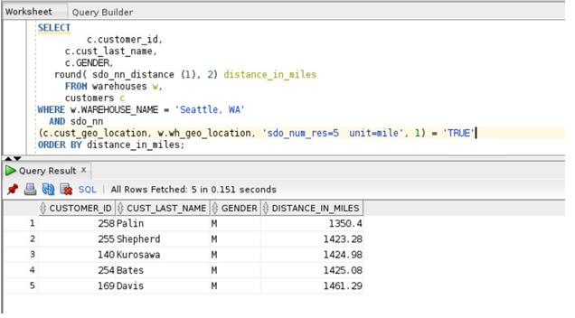

# Oracle Spatial  

**Perform location-based queries**

## Steps:


1. Find the five customers closest to warehouse named 'Seattle, WA' and put the results in order of distance
   
     ````
    <copy>
     SELECT c.customer_id,c.cust_last_name,c.GENDER,round( sdo_nn_distance (1), 2)  distance_in_miles  FROM warehouses w, customers c 
     WHERE w.WAREHOUSE_NAME = 'Seattle, WA'   AND sdo_nn
     (c.cust_geo_location,w.wh_geo_location,'sdo_num_res=5 unit=mile',1) = 'TRUE' ORDER BY distance_in_miles;


       </copy>
       ````

   

   **Notes:**

    -	The SDO-NN-DISTANCE operator is an ancillary operator to the SDO_NN operator; it can only be used within the SDO-NN operator. 
    The argument for this operator is a number that matches the number specified as the last argument of SDO-NN; in this example it is 1. There is no hidden meaning to this argument, it is simply a tag. If SDO-NN-DISTANCE() is specified, you can order the results by distance and guarantee that the first row returned is the closest. If the data you are querying is stored as longitude and latitude, the default unit for SDO-NN-DISTANCE is meters.
    -	The SDO-NN operator also has a UNIT parameter that determines the unit of measure returned by  SDO-NN-DISTANCE.
    - The ORDER BY DISTANCE clause ensures that the distances are returned in order, 
      with the shortest   distance first.


See an issue?  Please open up a request [here](https://github.com/oracle/learning-library/issues).