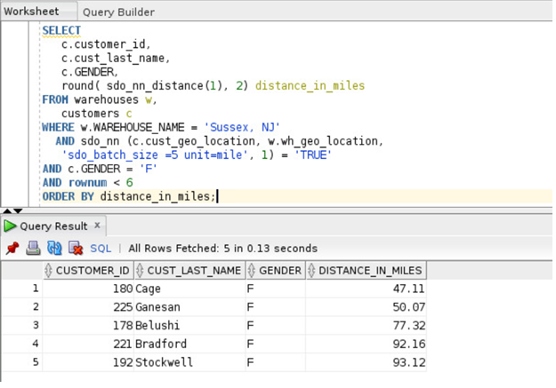

# Oracle Spatial  

**Perform location-based queries**

## Steps:

1. Find the five female customers closest to warehouse named 'Sussex, NJ', put the results in order of distance, and give the distance in miles

    ````
    <copy>
  SELECT c.customer_id,c.cust_last_name,c.GENDER,round( sdo_nn_distance(1), 2) distance_in_miles FROM warehouses w, customers c
   WHERE w.WAREHOUSE_NAME = 'Sussex, NJ'  AND sdo_nn (c.cust_geo_location, w.wh_geo_location,'sdo_batch_size =5 unit=mile', 1) = 'TRUE'
  AND c.GENDER = 'F'AND rownum< 6  ORDER BY distance_in_miles; 

  </copy>
    ````

     


   **Notes**

- SDO-BATCH-SIZE is a tunable parameter that may affect your query's performance. SDO-NN internally calculates that number of distances at a time. The initial batch of rows returned may not satisfy the constraints in the WHERE clause, so the number of rows specified by SDO-BATCH-SIZE is continuously returned until all the constraints in the WHERE clause are satisfied. You should choose a SDO-BATCH-SIZE that initially returns the number of rows likely to satisfy the constraints in your WHERE clause.
- The UNIT parameter used within the SDO-NN operator specifies the unit of measure of the SDO-NN-DISTANCE parameter. The default unit is the unit of measure associated with the data. For longitude and latitude data, the default is meters.
- c.gender = 'F' and rownum< 6 are the additional constraints in the WHERE clause. The rownum< 6 clause is necessary to limit the number of results returned to fewer than 6.
- The ORDER BY DISTANCE-IN-MILES clause ensures that the distances are returned in order, with the shortest distance first and the distances measured in miles.


See an issue?  Please open up a request [here](https://github.com/oracle/learning-library/issues).