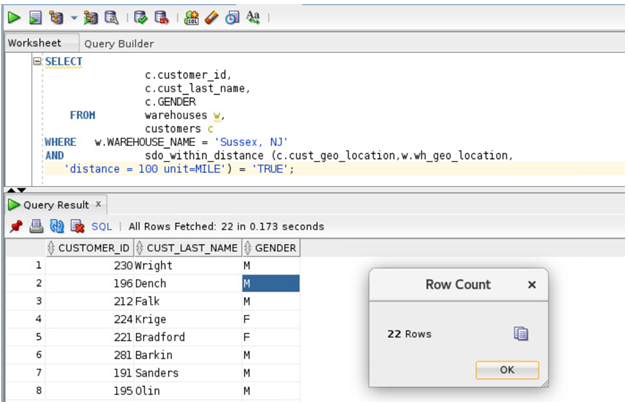

# Oracle Spatial  

**Perform location-based queries**

## Steps:


1. Find all the customers within 100 miles of warehouse named 'Sussex, NJ'
   
     ````
    <copy>
    SELECT c.customer_id,c.cust_last_name,c.GENDER
    FROM warehouses w,   customers c
    WHERE w.WAREHOUSE_NAME = 'Sussex, NJ' 
    AND sdo_within_distance (c.cust_geo_location,w.wh_geo_location,
   'distance = 100 unit=MILE') = 'TRUE';


       </copy>
       ````

   

  
 **Notes:**

- The SDO-WITHIN-DISTANCE operator returns the customers from the customers table that are within 100 miles of warehouse 3. The first argument to SDO-WITHIN-DISTANCE (c.cust-geo-location in the example above) is the column to search. The second argument to SDO-WITHIN-DISTANCE (w.wh-geo-location in the example above) is the location you want to determine the distances from. No assumptions should be made about the order of the returned results. For example, the first row returned is not guaranteed to be the customer closest to warehouse 3.
- The DISTANCE parameter used within the SDO-WITHIN-DISTANCE operator specifies the distance value; in this example it is 100.
- The UNIT parameter used within the SDO-WITHIN-DISTANCE operator specifies the unit of measure of the DISTANCE parameter. The default unit is the unit of measure associated with the data. For longitude and latitude data, the default is meters; in this example, it is miles.


See an issue?  Please open up a request [here](https://github.com/oracle/learning-library/issues).