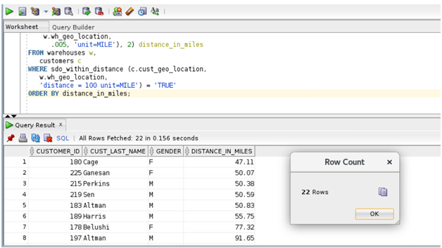

# Oracle Spatial  

**Perform location-based queries**

## Steps:

1. Find all the customers within 100 miles of warehouse named 'Sussex, NJ', put the results in order of distance, and give the distance in miles.   
   
    ````
    <copy>
    SELECT c.customer_id, c.cust_last_name,  c.GENDER,
    round( sdo_geom.sdo_distance (c.cust_geo_location,
    w.wh_geo_location, .005, 'unit=MILE'), 2) distance_in_miles
    FROM warehouses w, customers c
    WHERE sdo_within_distance (c.cust_geo_location,w.wh_geo_location, 
    distance = 100 unit=MILE') = 'TRUE'
    ORDER BY distance_in_miles;

 
    </copy>
     ````

     
     

 **Notes**

- The SDO-GEOM.SDO-DISTANCE function computes the exact distance between the customer's location and warehouse 3. The first argument to SDO_GEOM.SDO-DISTANCE (c.cust-geo-location in the example above) contains the customer's location whose distance from warehouse 3 is to be computed. The second argument to SDO-WITHIN-DISTANCE (w.wh-geo-location in the example above) is the location of warehouse 3, whose distance from the customer's location is to be computed.
- The third argument to SDO-GEOM.SDO-DISTANCE (0.005) is the tolerance value. The tolerance is a round-off error value used by Oracle Spatial. The tolerance is in meters for longitude and latitude data. In this example, the tolerance is 5 mm.
- The UNIT parameter used within the SDO-GEOM.SDO-DISTANCE parameter specifies the unit of measure of the distance computed by the SDO-GEOM.SDO-DISTANCE function. The default unit is the unit of measure associated with the data. For longitude and latitude data, the default is meters. In this example it is miles.
- The ORDER BY DISTANCE-IN-MILES clause ensures that the distances are returned in order, with the shortest distance first and the distances measured in miles.


See an issue?  Please open up a request [here](https://github.com/oracle/learning-library/issues).